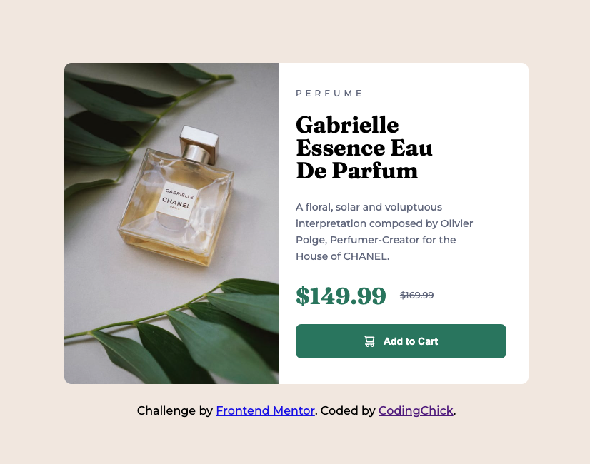
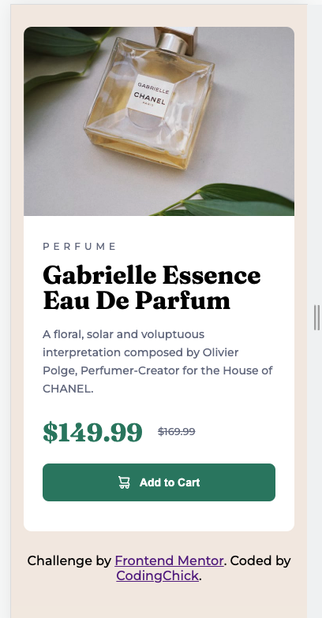
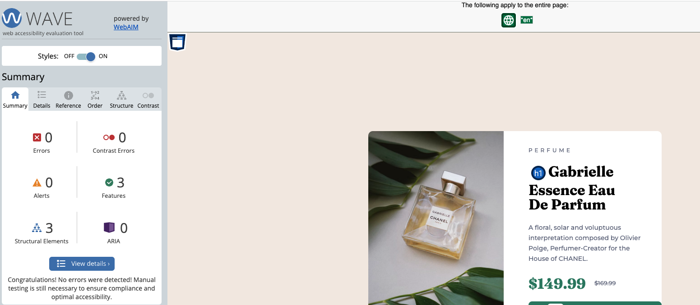
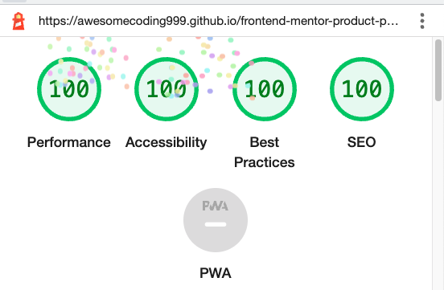

# Frontend Mentor - Product preview card component solution<!-- omit in toc -->

## Table of contents<!-- omit in toc -->

- [Final solution screenshots](#final-solution-screenshots)
  - [Desktop](#desktop)
  - [Mobile](#mobile)
- [Overview](#overview)
  - [The challenge](#the-challenge)
  - [Links](#links)
- [My process](#my-process)
  - [Built with](#built-with)
  - [What I learned](#what-i-learned)
  - [Accessibility and WAVE audits](#accessibility-and-wave-audits)
- [Author](#author)

## Final solution screenshots

### Desktop



### Mobile



## Overview

### The challenge

Users should be able to:

- View the optimal layout depending on their device's screen size
- See hover and focus states for interactive elements

### Links

- [GitHub repo url](https://github.com/awesomeCoding999/frontend-mentor-product-preview-card)
- [Live GitHub pages URL](https://awesomecoding999.github.io/frontend-mentor-product-preview-card/)

## My process

### Built with

- Semantic HTML5 markup
- CSS custom properties
- Flexbox
- Mobile-first workflow

### What I learned

I really tried to learn more about accessibility with this challenge. For the button, I learned that you should add the `aria-label` for icons used inside a button from this [article](https://a11y-style-guide.com/style-guide/section-general.html).

```html
<button class="cart-btn">
  
  Add to Cart
</button>
```

I also learned how to use the `picture` element to show different images based on device screen size.

Link to [MDN docs](https://developer.mozilla.org/en-US/docs/Web/HTML/Element/picture) for the `picture` element.

```html
<picture>
  <source
    class="product-img"
    media="(min-width: 1024px)"
    srcset="./images/image-product-desktop.jpg"
    alt="desktop perfume"
  />
  
</picture>
```

### Accessibility and WAVE audits

I used the WAVE extension and Google Lighthouse (for both mobile and desktop) to ensure that I was meeting best practices, accessibility, performance and SEO.




## Author

- Frontend Mentor - [@awesomeCoding999](https://www.frontendmentor.io/profile/awesomeCoding999)
